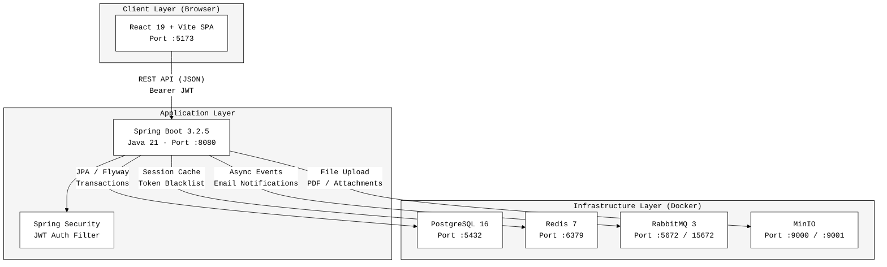
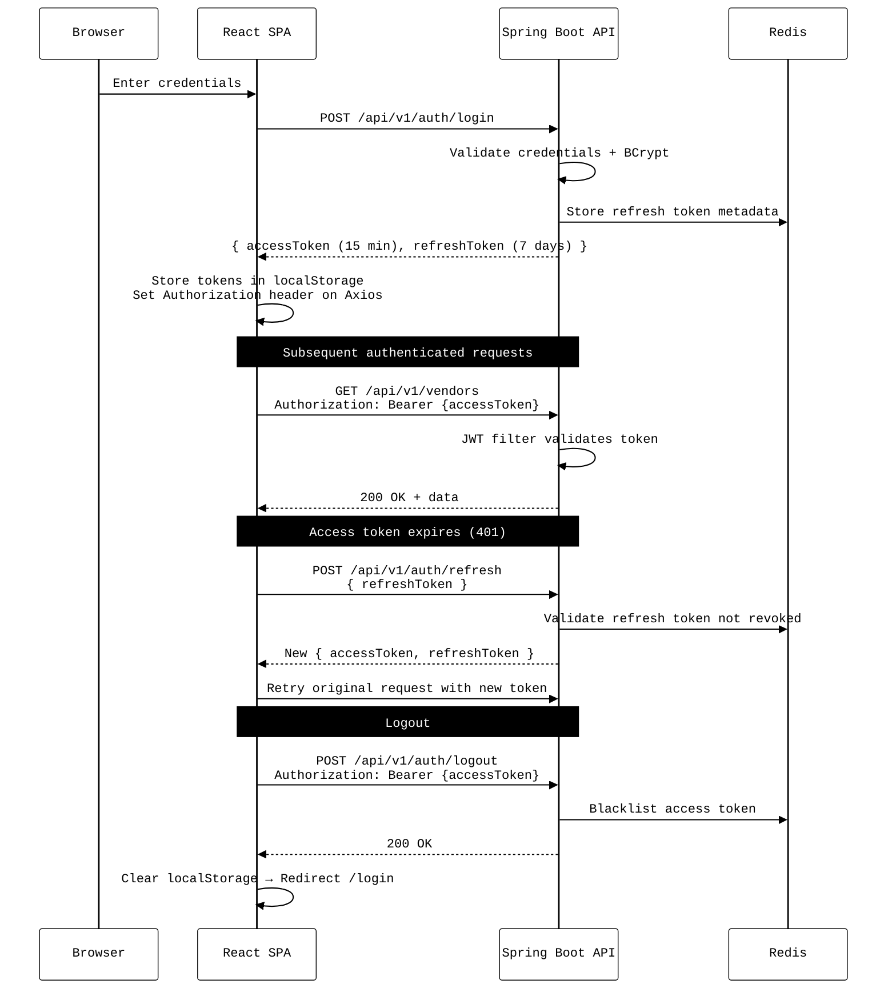
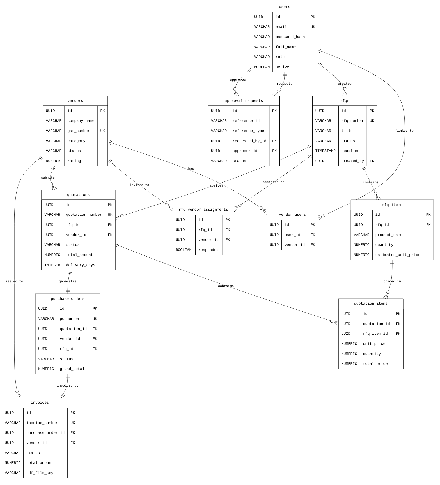
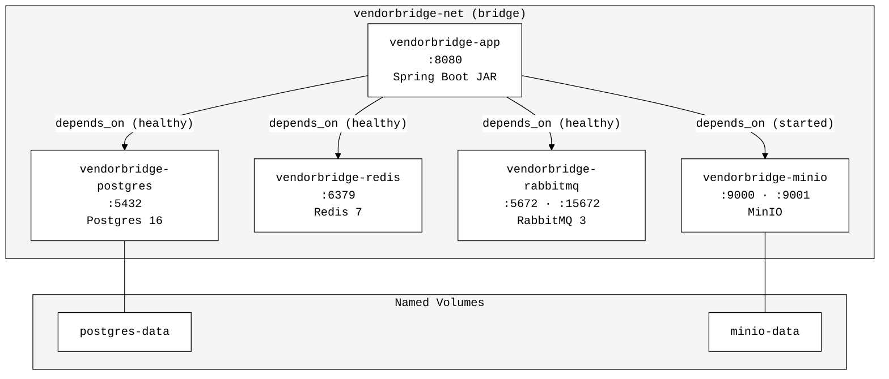

# VendorBridge

VendorBridge is an integrated procurement and vendor management ERP platform designed to bridge the operational gap between businesses and their suppliers. The platform provides a centralized, transparent workspace where vendors and enterprise clients can manage the complete procurement lifecycle — from raising a Request for Quotation (RFQ), evaluating vendor quotations, routing approvals, generating Purchase Orders, all the way through to invoice processing and payment tracking.

> **Live Application:** *(URL to be added)*

> **API Documentation:** `http://localhost:8080/swagger-ui.html` (after local setup)

---

## Table of Contents

- [System Architecture](#system-architecture)
- [Tech Stack](#tech-stack)
- [Procurement Workflow](#procurement-workflow)
- [Authentication Flow](#authentication-flow)
- [Role-Based Access Control](#role-based-access-control)
- [Database Schema](#database-schema)
- [Docker Infrastructure](#docker-infrastructure)
- [Project Structure](#project-structure)
- [Local Setup](#local-setup)
- [Build Commands](#build-commands)
- [Environment Variables](#environment-variables)
- [API Reference](#api-reference)
- [Team](#team)

---

## System Architecture

VendorBridge uses a **decoupled client-server architecture**. The React SPA communicates with a Spring Boot REST API over HTTP. All infrastructure services (PostgreSQL, Redis, RabbitMQ, MinIO) are fully containerised via Docker Compose.



---

## Tech Stack

### Frontend

| Concern | Technology |
|---|---|
| Framework | React 19 |
| Build Tool | Vite 8 |
| Routing | React Router v7 |
| HTTP Client | Axios (with JWT interceptor + auto-refresh) |
| State Management | Context API (`AuthContext`) |
| Charts | Chart.js 4 + react-chartjs-2 |
| Icons | Lucide React |
| Dev Server Port | `5173` |

### Backend

| Concern | Technology |
|---|---|
| Language | Java 21 |
| Framework | Spring Boot 3.2.5 |
| Security | Spring Security + JJWT 0.12.5 |
| Persistence | Spring Data JPA + Hibernate |
| Database Migrations | Flyway |
| DTO Mapping | MapStruct 1.5.5 |
| PDF Generation | iText7 7.2.5 |
| Excel Export | Apache POI 5.2.5 |
| API Documentation | SpringDoc OpenAPI (Swagger UI) |
| Boilerplate Reduction | Lombok |
| API Port | `8080` |

### Infrastructure

| Service | Image | Port(s) | Purpose |
|---|---|---|---|
| PostgreSQL | `postgres:16-alpine` | `5432` | Primary relational database |
| Redis | `redis:7-alpine` | `6379` | Session cache, JWT blacklist, app cache |
| RabbitMQ | `rabbitmq:3-management-alpine` | `5672`, `15672` | Async message queue for notifications |
| MinIO | `minio/minio` | `9000`, `9001` | S3-compatible object storage for files & PDFs |

---

## Procurement Workflow

The full procurement lifecycle in VendorBridge follows this pipeline:

```mermaid
%%{init: {'theme': 'base', 'themeVariables': {'primaryColor': '#ffffff', 'primaryBorderColor': '#000000', 'primaryTextColor': '#000000', 'lineColor': '#000000', 'edgeLabelBackground': '#ffffff', 'clusterBkg': '#f5f5f5', 'clusterBorder': '#000000', 'titleColor': '#000000', 'nodeBorder': '#000000', 'mainBkg': '#ffffff', 'nodeTextColor': '#000000', 'fontFamily': 'monospace'}}}%%
flowchart LR
    A([Procurement\nOfficer]) --> B

    subgraph RFQ["1. RFQ Phase"]
        B["Create RFQ\n(DRAFT)"]
        B --> C["Add Line Items\n& Attachments"]
        C --> D["Assign Vendors\n& Publish"]
        D --> E["RFQ: PUBLISHED"]
    end

    subgraph QUOT["2. Quotation Phase"]
        E --> F([Vendor\nUser])
        F --> G["Submit Quotation\n(SUBMITTED)"]
        G --> H["Internal Review\n(UNDER_REVIEW)"]
    end

    subgraph APPR["3. Approval Phase"]
        H --> I{Manager\nApproval}
        I -- "APPROVED" --> J["Quotation: SELECTED"]
        I -- "REJECTED" --> K["Quotation: REJECTED"]
    end

    subgraph PO["4. Purchase Order Phase"]
        J --> L["Generate PO\n(GENERATED)"]
        L --> M["Send to Vendor\n(SENT_TO_VENDOR)"]
        M --> N["Vendor Acknowledges\n(ACKNOWLEDGED)"]
        N --> O["In Progress → Delivered"]
    end

    subgraph INV["5. Invoice Phase"]
        O --> P["Generate Invoice\n(PDF via iText7)"]
        P --> Q["Invoice: SENT → RECEIVED"]
        Q --> R["APPROVED → PAID"]
    end
```



### Status Reference

| Entity | Valid Statuses |
|---|---|
| **RFQ** | `DRAFT` → `PUBLISHED` → `CLOSED` / `CANCELLED` |
| **Quotation** | `DRAFT` → `SUBMITTED` → `UNDER_REVIEW` → `SELECTED` / `REJECTED` |
| **Purchase Order** | `GENERATED` → `SENT_TO_VENDOR` → `ACKNOWLEDGED` → `IN_PROGRESS` → `PARTIALLY_DELIVERED` → `DELIVERED` / `CANCELLED` |
| **Invoice** | `GENERATED` → `SENT` → `RECEIVED` → `APPROVED` → `PAID` / `OVERDUE` / `CANCELLED` |
| **Approval** | `PENDING` → `APPROVED` / `REJECTED` |
| **Vendor** | `PENDING_APPROVAL` → `ACTIVE` / `INACTIVE` / `BLACKLISTED` |

---

## Authentication Flow

VendorBridge uses stateless JWT authentication with short-lived access tokens and long-lived refresh tokens. Revoked tokens are blacklisted in Redis.



---

## Role-Based Access Control

VendorBridge enforces four roles at both the frontend (route guards) and backend (`@PreAuthorize`).

```mermaid
%%{init: {'theme': 'base', 'themeVariables': {'primaryColor': '#ffffff', 'primaryBorderColor': '#000000', 'primaryTextColor': '#000000', 'lineColor': '#000000', 'edgeLabelBackground': '#ffffff', 'clusterBkg': '#f5f5f5', 'clusterBorder': '#000000', 'titleColor': '#000000', 'nodeBorder': '#000000', 'mainBkg': '#ffffff', 'nodeTextColor': '#000000', 'fontFamily': 'monospace'}}}%%
graph TD
    subgraph ROLES["User Roles"]
        AD["ADMIN"]
        PO["PROCUREMENT_OFFICER"]
        MG["MANAGER"]
        VU["VENDOR_USER"]
    end

    subgraph FEATURES["Application Features"]
        DB["Dashboard"]
        VD["Vendor Management"]
        RF["RFQ Management"]
        QT["Quotations"]
        AP["Approvals"]
        POR["Purchase Orders"]
        IN["Invoices"]
        RP["Reports"]
        ACT["Activity / Audit Log"]
        USR["User Registration"]
    end

    AD --> DB
    AD --> VD
    AD --> RF
    AD --> QT
    AD --> AP
    AD --> POR
    AD --> IN
    AD --> RP
    AD --> ACT
    AD --> USR

    PO --> DB
    PO --> VD
    PO --> RF
    PO --> QT
    PO --> AP
    PO --> POR
    PO --> IN

    MG --> DB
    MG --> QT
    MG --> AP
    MG --> POR
    MG --> IN
    MG --> RP

    VU --> DB
    VU --> QT
    VU --> AP
    VU --> POR
    VU --> IN
```



| Role | Description | Key Permissions |
|---|---|---|
| `ADMIN` | Full system access | All features + user management + audit logs |
| `PROCUREMENT_OFFICER` | Buyer-side operations | Create/manage RFQs, vendors, POs |
| `MANAGER` | Review & approve | Approve quotations, view reports |
| `VENDOR_USER` | Supplier-side access | Submit quotations, view their POs & invoices |

---

## Database Schema

All tables are created and versioned via **Flyway** migrations (`V1` through `V12`).



---

## Docker Infrastructure

All backend services are orchestrated via `docker-compose.yml` in the `backend/` directory.



---

## Project Structure

```
VendorBridge/
│
├── frontend/                        # React 19 + Vite SPA
│   ├── public/                      # Static assets
│   ├── src/
│   │   ├── components/              # Shared UI: Layout, Navbar, Sidebar
│   │   ├── constants/               # roles.js — role enums & groupings
│   │   ├── context/
│   │   │   └── AuthContext.jsx      # Global auth state + token management
│   │   ├── pages/                   # One file per route
│   │   │   ├── Login.jsx
│   │   │   ├── Register.jsx
│   │   │   ├── Dashboard.jsx
│   │   │   ├── Vendors.jsx
│   │   │   ├── Rfqs.jsx
│   │   │   ├── Quotations.jsx
│   │   │   ├── Approvals.jsx
│   │   │   ├── PurchaseOrders.jsx
│   │   │   ├── Invoices.jsx
│   │   │   ├── Reports.jsx
│   │   │   └── Activity.jsx
│   │   ├── services/                # Axios service modules (one per domain)
│   │   │   ├── api.js               # Axios instance, interceptors, token refresh
│   │   │   ├── vendorService.js
│   │   │   ├── rfqService.js
│   │   │   ├── quotationService.js
│   │   │   ├── approvalService.js
│   │   │   ├── poService.js
│   │   │   ├── invoiceService.js
│   │   │   ├── reportService.js
│   │   │   └── dashboardService.js
│   │   └── utils/                   # Formatting & helper utilities
│   ├── index.html
│   ├── vite.config.js
│   └── package.json
│
├── backend/                         # Java 21 + Spring Boot 3.2.5
│   ├── src/main/java/com/vendorbridge/
│   │   ├── auth/                    # Login, register, JWT, password reset
│   │   ├── user/                    # User profiles
│   │   ├── vendor/                  # Vendor CRUD, status management
│   │   ├── rfq/                     # RFQ creation, item management, vendor assignment
│   │   ├── quotation/               # Quotation submission & review
│   │   ├── approval/                # Approval request routing
│   │   ├── purchaseorder/           # PO generation & status tracking
│   │   ├── invoice/                 # Invoice generation (PDF via iText7)
│   │   ├── notification/            # RabbitMQ consumer + email via Thymeleaf
│   │   ├── report/                  # Procurement reports (PDF & Excel export)
│   │   ├── audit/                   # Audit trail logging
│   │   ├── config/                  # Spring configs: Security, Redis, CORS, Minio, etc.
│   │   └── shared/                  # Enums, DTOs, exceptions, utils
│   │       └── enums/               # Role, RfqStatus, PoStatus, InvoiceStatus, …
│   ├── src/main/resources/
│   │   ├── application.yml          # Main configuration
│   │   ├── application-dev.yml      # Dev profile overrides
│   │   ├── db/migration/            # Flyway SQL scripts V1–V12
│   │   └── templates/               # Thymeleaf email templates
│   ├── Dockerfile                   # Multi-stage build (Maven → JRE alpine)
│   ├── docker-compose.yml           # Full local stack (5 services)
│   ├── .env.example                 # Environment variable template
│   └── pom.xml                      # Maven build descriptor
│
└── README.md
```

---

## Local Setup

### Prerequisites

| Requirement | Version | Notes |
|---|---|---|
| Java JDK | 21+ | Use [SDKMAN](https://sdkman.io/) or [Temurin](https://adoptium.net/) |
| Maven | 3.9+ | Or use the `./mvnw` wrapper if present |
| Node.js | 18+ | [nodejs.org](https://nodejs.org/) |
| npm | 9+ | Bundled with Node |
| Docker Desktop | Latest | Required for the full infrastructure stack |

---

### Option A — Run with Docker (Recommended)

Spins up all 5 services (app + Postgres + Redis + RabbitMQ + MinIO) with a single command.

```bash
# 1. Clone the repository
git clone https://github.com/NehanshuRathod/VendorBridge.git
cd VendorBridge

# 2. Configure environment
cd backend
cp .env.example .env
# Edit .env if you want non-default credentials

# 3. Build and start the full stack
docker compose up --build

# Stop the stack
docker compose down

# Stop and destroy all volumes (wipe database)
docker compose down -v
```

> **Services accessible after startup:**
> - Spring Boot API → `http://localhost:8080`
> - Swagger UI → `http://localhost:8080/swagger-ui.html`
> - RabbitMQ Management → `http://localhost:15672` *(user: `vendorbridge`, pass: `rabbitmq_secret`)*
> - MinIO Console → `http://localhost:9001` *(user: `minioadmin`, pass: `minioadmin_secret`)*

---

### Option B — Run Services via Docker, App Locally

Use this when actively developing the backend and you want hot-reload.

```bash
# Start only the infrastructure services (no Spring Boot app)
cd backend
docker compose up postgres redis rabbitmq minio -d

# Run the Spring Boot app locally
./mvnw spring-boot:run -Dspring-boot.run.profiles=dev
# OR with Maven installed globally
mvn spring-boot:run -Dspring-boot.run.profiles=dev
```

---

### Frontend Setup

Run in a separate terminal from the project root:

```bash
cd frontend

# Install dependencies
npm install

# Start Vite dev server
npm run dev
```

The frontend dev server starts at **`http://localhost:5173`** and proxies API calls to `http://localhost:8080/api/v1`.

---

## Build Commands

### Frontend

```bash
cd frontend

# Install dependencies
npm install

# Start development server (hot-reload, port 5173)
npm run dev

# Production build — outputs to frontend/dist/
npm run build

# Preview the production build locally
npm run preview

# Lint the codebase
npm run lint
```

### Backend

```bash
cd backend

# Download all dependencies (offline cache — useful before builds without internet)
mvn dependency:go-offline

# Compile the project
mvn compile

# Run all tests
mvn test

# Run tests with Testcontainers (spins up real Postgres + RabbitMQ via Docker)
mvn verify

# Package as executable JAR (skip tests)
mvn clean package -DskipTests

# Package as executable JAR (with tests)
mvn clean package

# Run the packaged JAR directly
java -jar target/vendorbridge-1.0.0-SNAPSHOT.jar

# Run with Spring Boot Maven plugin (dev mode)
mvn spring-boot:run

# Run with a specific profile
mvn spring-boot:run -Dspring-boot.run.profiles=dev

# Clean build artifacts
mvn clean
```

### Docker

```bash
cd backend

# Build & start entire stack (detached)
docker compose up --build -d

# View live logs for all services
docker compose logs -f

# View logs for a specific service
docker compose logs -f vendorbridge-app

# Rebuild only the app image (after code change)
docker compose up --build vendorbridge-app

# Stop all services (preserve volumes)
docker compose down

# Stop and wipe all data volumes
docker compose down -v

# Check health of all services
docker compose ps

# Open a psql shell into the database
docker compose exec postgres psql -U vendorbridge -d vendorbridge

# Open a Redis CLI shell
docker compose exec redis redis-cli -a redis_secret
```

---

## Environment Variables

Copy `backend/.env.example` to `backend/.env` and fill in the values. All variables have sensible defaults for local development.

```bash
cp backend/.env.example backend/.env
```

For the frontend, create `frontend/.env.local`:

```env
VITE_API_BASE_URL=http://localhost:8080/api/v1
```

Key backend variables:

| Variable | Default | Description |
|---|---|---|
| `SPRING_DATASOURCE_URL` | `jdbc:postgresql://localhost:5432/vendorbridge` | PostgreSQL connection string |
| `SPRING_DATASOURCE_USERNAME` | `vendorbridge` | DB user |
| `SPRING_DATASOURCE_PASSWORD` | `vendorbridge_secret` | DB password |
| `REDIS_HOST` | `localhost` | Redis hostname |
| `REDIS_PASSWORD` | `redis_secret` | Redis auth password |
| `RABBITMQ_HOST` | `localhost` | RabbitMQ hostname |
| `RABBITMQ_USER` | `vendorbridge` | RabbitMQ user |
| `RABBITMQ_PASSWORD` | `rabbitmq_secret` | RabbitMQ password |
| `MINIO_ENDPOINT` | `http://localhost:9000` | MinIO S3 endpoint |
| `MINIO_ACCESS_KEY` | `minioadmin` | MinIO access key |
| `MINIO_SECRET_KEY` | `minioadmin_secret` | MinIO secret |
| `JWT_SECRET` | *(64+ char string)* | HMAC signing key — **change in production** |
| `JWT_ACCESS_TOKEN_EXPIRY` | `900000` | Access token TTL in ms (15 min) |
| `JWT_REFRESH_TOKEN_EXPIRY` | `604800000` | Refresh token TTL in ms (7 days) |
| `MAIL_USERNAME` | *(empty)* | SMTP email address |
| `MAIL_PASSWORD` | *(empty)* | SMTP app password |

> **Docker Compose note:** When running via Docker Compose, set hosts to service names (e.g. `REDIS_HOST=redis`, `RABBITMQ_HOST=rabbitmq`). When running the app locally against Docker-hosted services, use `localhost`.

---

## API Reference

The full interactive API reference is available via Swagger UI once the backend is running:

```
http://localhost:8080/swagger-ui.html
```

Raw OpenAPI JSON spec:

```
http://localhost:8080/api-docs
```

Spring Boot Actuator health endpoint:

```
http://localhost:8080/actuator/health
```

### API Base URL

```
http://localhost:8080/api/v1
```

### Endpoint Groups

| Prefix | Module | Description |
|---|---|---|
| `/api/v1/auth` | Auth | Login, register, token refresh, logout, password reset |
| `/api/v1/users` | Users | User management |
| `/api/v1/vendors` | Vendors | Vendor CRUD, status, rating |
| `/api/v1/rfqs` | RFQ | Create, publish, assign vendors, manage items |
| `/api/v1/quotations` | Quotations | Submit, review, select quotations |
| `/api/v1/approvals` | Approvals | Approval routing and decisions |
| `/api/v1/purchase-orders` | Purchase Orders | Generate and track POs |
| `/api/v1/invoices` | Invoices | Invoice generation, PDF download |
| `/api/v1/reports` | Reports | Procurement analytics, Excel/PDF export |
| `/api/v1/notifications` | Notifications | In-app notification feed |

---

## Team

VendorBridge was designed, architected, and engineered by **Team HARDLUCK**.

| Name |
|---|
**Nehanshu Rathod**
**Jyot Raval**
**Ayaz Deariya**
**Kaushik Parmar**
